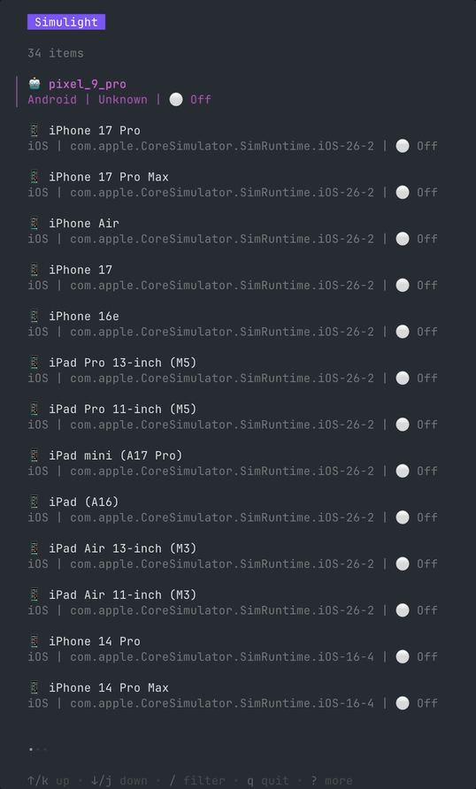

# Simmer

> A lightweight, modern TUI for managing iOS Simulators and Android Emulators on macOS.

<p align="center">
  
</p>

## 🚀 Features

- **Unified View:** See all your iOS and Android virtual devices in one list.
- **Real-time Status:** Instantly see if a device is `Running` or `Shutdown`.
- **Fast Discovery:** Parallelized scanning using `xcrun simctl` and `adb`.
- **Filtering:** Quickly find devices by name or OS version using built-in fuzzy search.
- **Modern UI:** Built with the latest Charm v2 terminal stack.

## 🛠 Tech Stack

- **Go 1.25+**
- **[Bubble Tea v2](https://charm.land/bubbletea/v2):** The TUI framework.
- **[Bubbles v2](https://charm.land/bubbles/v2):** Reusable UI components (List, Status Bar).
- **[Lip Gloss v2](https://charm.land/lipgloss/v2):** Beautiful terminal styling.

## 📋 Prerequisites

- **macOS** (Required for iOS simulators).
- **Xcode** with Command Line Tools installed.
- **Android SDK** with `adb` and `emulator` in your `PATH`.

## 📖 Usage Guide

### Running locally
```bash
go run main.go
```

### Keybindings
- `↑/↓/k/j`: Navigate list
- `/`: Search/Filter
- `r`: Refresh device list
- `q/ctrl+c`: Quit
- `enter`: (Future) Launch selected device

### Building for production
```bash
go build -o simmer main.go
```

### Running Tests
```bash
go test ./... -v
```

## 🏗 Project Structure

- `main.go`: Application entry point and TUI state management (Model-Update-View).
- `pkg/device/`: 
    - `device.go`: Core interfaces and the concurrent `Coordinator`.
    - `ios.go`: `xcrun simctl` integration and parsing.
    - `android.go`: `adb` and `emulator` integration.

## 📹 Recording a Demo
This project uses [VHS](https://github.com/charmbracelet/vhs) for terminal recording. To update the demo GIF:

1. Install VHS: `brew install vhs`
2. Run: `vhs demo.tape`

---
Built with ❤️ using the Charm Stack.
