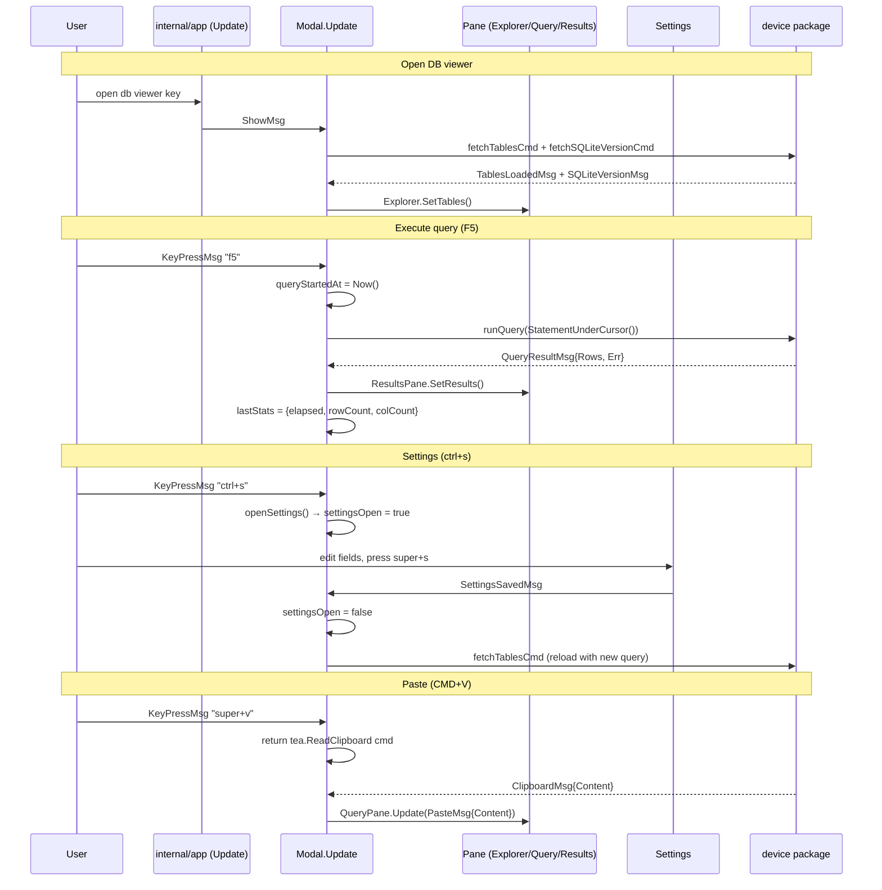

## `internal/ui/dbviewer/` — SQLite database viewer overlay

A self-contained full-screen TUI overlay for inspecting SQLite databases
on connected devices. Launched from the main pane when the user selects a
`.db` file; dismissed with `Esc` or `q`.

> Stateless pane interface + async Cmds + row-slice compositor — no nested Bubble Tea programs.

---

## Architecture overview

```
dbviewer/
  modal.go            — Modal struct, SetFile, openSettings, scrim
  modal_update.go     — Update, handleMouseClick, handleMouseWheel
  modal_view.go       — View (row-compositor): title, body, status bar
  modal_commands.go   — async Cmds: fetchTablesCmd, executeQueryCmd, …
  modal_messages.go   — all Msg types emitted by this package
  layout.go           — computeLayout: single source of dimensional truth
  pane.go             — pane interface + three adapters (explorer/query/results)
  explorer.go         — Explorer: tree sidebar (tables/views/indexes/triggers)
  explorer_data.go    — explorerNode tree builder + filteredVisibleItems
  query_pane.go       — QueryPane: textarea SQL editor + file state
  results_pane.go     — ResultsPane: bubbles/table result grid
  settings.go         — Settings: inline config form (script path + tables query)
  render_helpers.go   — renderHelpers: blank/fill/sep primitives
  styles.go           — viewerStyles
```

**Pattern:** `Modal` holds a fixed-size `[3]pane` array. Panes are addressed
by constant index (`paneSidebar`, `paneQuery`, `paneResults`). `Update` routes
messages to the focused pane; `View` calls each pane's `Rows` method and
composites the result into one flat `[]string` that is joined for display.

---

## 1. `Modal` struct (`modal.go`)

```go
type Modal struct {
    width, height int
    focus         int           // paneSidebar | paneQuery | paneResults
    panes         [paneCount]pane
    onClose       func() tea.Msg

    device        device.Device
    packageID     string
    dbPath        string
    dbName        string
    sqliteVersion string
    tablesQuery   string        // effective query used by fetchTablesCmd

    lastStats      queryStats
    queryStartedAt time.Time

    settingsOpen bool
    settings     Settings
}
```

`onClose` is the close callback provided by the parent. Calling it returns
the correct message for the parent's own state machine — Modal never imports
the parent package.

`tablesQuery` is loaded from config in `SetFile` and used every time the table
list is refreshed. Changing it via Settings → Save triggers a new
`fetchTablesCmd` on the next `SettingsSavedMsg`.

### `SetFile` — attach and trigger async loads

```go
func (m *Modal) SetFile(dev device.Device, packageID, dbPath, dbName string) tea.Cmd {
    m.device = dev
    // …
    cfg, _ := config.Load()
    m.tablesQuery = cfg.EffectiveTablesQuery()
    return tea.Batch(m.fetchSQLiteVersionCmd(), m.fetchTablesCmd())
}
```

Loads config synchronously (fast, local file), then fires two background
commands concurrently via `tea.Batch`. UI is immediately usable with a
"Loading…" spinner while results arrive.

---

## 2. `pane` interface (`pane.go`)

```go
type pane interface {
    Update(tea.Msg) (pane, tea.Cmd)
    Rows(width, height int, focused bool) []string
    Focus() (pane, tea.Cmd)
    Blur() pane
}
```

`Rows` returns a `[]string` where every element is exactly `width` visual
cells wide. The modal compositor splices these slices together column-wise
and row-wise to build the final frame — no Lip Gloss layout engine needed at
the top level.

Three **adapter types** wrap the concrete pane structs:

| Adapter | Wraps | Notes |
|---|---|---|
| `explorerPane` | `Explorer` | Focus/Blur are no-ops (Explorer manages its own cursor) |
| `queryPaneAdapter` | `QueryPane` | Focus → `FocusEditor()`, Blur → `BlurEditor()` |
| `resultsPaneAdapter` | `ResultsPane` | Focus/Blur are no-ops |

Adapters let the concrete types expose richer APIs (e.g., `QueryPane.SaveCmd()`,
`QueryPane.StatementUnderCursor()`) without leaking them through the `pane`
interface. Modal accesses the richer API via type assertions only when it needs
to call those methods.

---

## 3. `layout.go` — single source of dimensional truth

```go
type layout struct {
    ModalW, ModalH          int
    InnerW, InnerH          int
    SidebarW, DivW, RightW  int
    BodyH, QueryH, ResultsH int
    DivRow                  int  // body-relative row of horizontal divider
}

func computeLayout(termW, termH int) layout { … }
```

`computeLayout` is called **once per Update/View invocation** and its result
passed to every sub-renderer. No dimension is computed in more than one place.
This is the single fix for mouse-click coordinate math: the same `l.DivRow`
that positions the horizontal divider in View is used to hit-test clicks in
`handleMouseClick`.

Key constants:
- `sidebarW = 28` — sidebar column count
- Query pane gets `bodyH / 3`; results pane gets the remainder minus 1 (divider row)

---

## 4. `modal_update.go` — message routing

`Update` follows a strict priority order:

```
1. Settings messages (SettingsSavedMsg / SettingsCancelMsg) → always handled first
2. settingsOpen == true → route everything to m.settings.Update
3. Domain messages (SQLiteVersionMsg, TablesLoadedMsg, ColumnsLoadedMsg,
                    QueryResultMsg, FileSavedMsg) → update model fields
4. Paste / Clipboard messages → forward to focused pane
5. Mouse messages → handleMouseClick / handleMouseWheel
6. Key messages → key switch (global shortcuts then pane forwarding)
```

Global key bindings:

| Key | Action |
|---|---|
| `ctrl+s` | Open settings form |
| `super+s` | Save query file |
| `super+v` | Request OSC-52 clipboard read (CMD+V fallback) |
| `f5` | Execute statement at cursor |
| `ctrl+enter` | Execute full editor content |
| `tab` / `shift+tab` | Cycle focus across panes |
| `ctrl+l` | Focus query pane |
| `ctrl+j` | Query → Results |
| `ctrl+k` | Results → Query |
| `ctrl+h` | Focus sidebar (or collapse if already focused) |
| `space` (sidebar) | Build SELECT query for selected node and run it |
| `enter` (sidebar) | Expand node / fetch columns |
| `esc` / `q` | Close overlay |

### Paste pipeline

```
Bracketed paste:  tea.PasteMsg  ──▶ focused pane
OSC-52 result:    tea.ClipboardMsg{Content} ──▶ tea.PasteMsg{Content} ──▶ query pane
CMD+V shortcut:   "super+v" key ──▶ func() tea.Msg { return tea.ReadClipboard() }
```

`tea.ReadClipboard()` returns a `tea.Msg`, not a `tea.Cmd`, so it must be
wrapped in a closure.

### Query execution

```
f5           → executeQueryCmd()  → StatementUnderCursor() → runQuery(stmt)
ctrl+enter   → executeAllCmd()   → editor.Value()          → runQuery(all)
space (sidebar) → setQueryText(sql) + executeQueryCmd()
```

Both paths record `m.queryStartedAt = time.Now()` before dispatching.
`QueryResultMsg` uses `time.Since(m.queryStartedAt)` to compute elapsed time
stored in `m.lastStats`.

---

## 5. `modal_commands.go` — async Cmds

| Cmd | Tool | Returns |
|---|---|---|
| `fetchSQLiteVersionCmd` | `device.SQLiteVersion` | `SQLiteVersionMsg` |
| `fetchTablesCmd` | `device.ListSQLiteObjects(m.tablesQuery)` | `TablesLoadedMsg` |
| `fetchColumnsCmd` | `device.ListSQLiteColumns` | `ColumnsLoadedMsg` |
| `runQuery(query)` | `device.RunSQLiteQuery` | `QueryResultMsg` |

`fetchColumnsCmd` mutates `node.loading = true` before the goroutine runs
and sets `node.loading = false` on `ColumnsLoadedMsg`. Pointer is safe: the
node lives in the explorer tree, which is owned by the modal's pane slice.

---

## 6. `modal_messages.go` — message types

```go
// Lifecycle
type ShowMsg struct{}

// Async results
type SQLiteVersionMsg  struct{ Version string; Err error }
type TablesLoadedMsg   struct{ Objects device.SQLiteObjects; Err error }
type ColumnsLoadedMsg  struct{ node *explorerNode; cols []device.ColumnInfo; err error }
type QueryResultMsg    struct{ Rows [][]string; Err error }

// File operations
type FileSavedMsg      struct{ Err error }

// Settings
type SettingsSavedMsg  struct{ Err error }
type SettingsCancelMsg struct{}
```

`SettingsSavedMsg` and `SettingsCancelMsg` are emitted by the Settings component
and must be listed in the parent app's `Update` routing so they are forwarded
to the modal even after being relayed through the app layer.

---

## 7. Settings form (`settings.go`)

`Settings` is an **inline** form rendered by the modal instead of normal pane
content — not a separate Bubble Tea program or overlay compositor layer.

```go
type Settings struct {
    scriptPath  textinput.Model   // single-line path input
    tablesQuery textarea.Model    // multi-line SQL input
    focus       settingsFocus     // Script | Query | Cancel | Save
    rh          renderHelpers
}
```

`settingsFocus` cycles: Script → Query → Cancel → Save → Script.

Key bindings inside the form:

| Key | Action |
|---|---|
| `tab` / `shift+tab` | Cycle focus |
| `enter` (Save) | `saveConfigCmd(currentConfig())` |
| `enter` (Cancel) | `SettingsCancelMsg{}` |
| `super+s` | Save regardless of focus |
| `esc` | `SettingsCancelMsg{}` |

`Rows(width, height)` renders the form into a flat `[]string` that the modal
compositor places in the body area exactly as it does for normal panes.

### Config persistence

`saveConfigCmd` calls `config.Save` in a goroutine, returning `SettingsSavedMsg`.
The modal closes the settings form on receipt; if `Err != nil` the closure
still happens (no retry UI currently).

When the settings form is dismissed (either save or cancel), the modal reopens
with the settings fields discarded — the form re-reads disk on the next `ctrl+s`.

---

## Message flow diagram



---

## Why this way?

**Row-slice compositor vs Lip Gloss layout:** Lip Gloss `JoinHorizontal` /
`JoinVertical` pad and re-wrap content, making pixel-accurate hit testing for
mouse clicks fragile. Slicing `[]string` gives exact control over which terminal
row/column each cell occupies.

**Pane interface vs type switch:** `[3]pane` array + index constants means the
modal's routing code never grows with new pane types. Adding a pane means
writing a new adapter, not touching Update or View.

**Inline settings vs overlay compositor:** Settings is relatively simple (2
fields, 2 buttons). Rendering it as a flat `Rows` slice reuses the same
compositor path as normal content with zero additional abstraction.

**`computeLayout` as single source:** Mouse coordinates, render positions, and
pane height allocations all derive from one call. Stale coordinate bugs are
impossible across Update and View.
