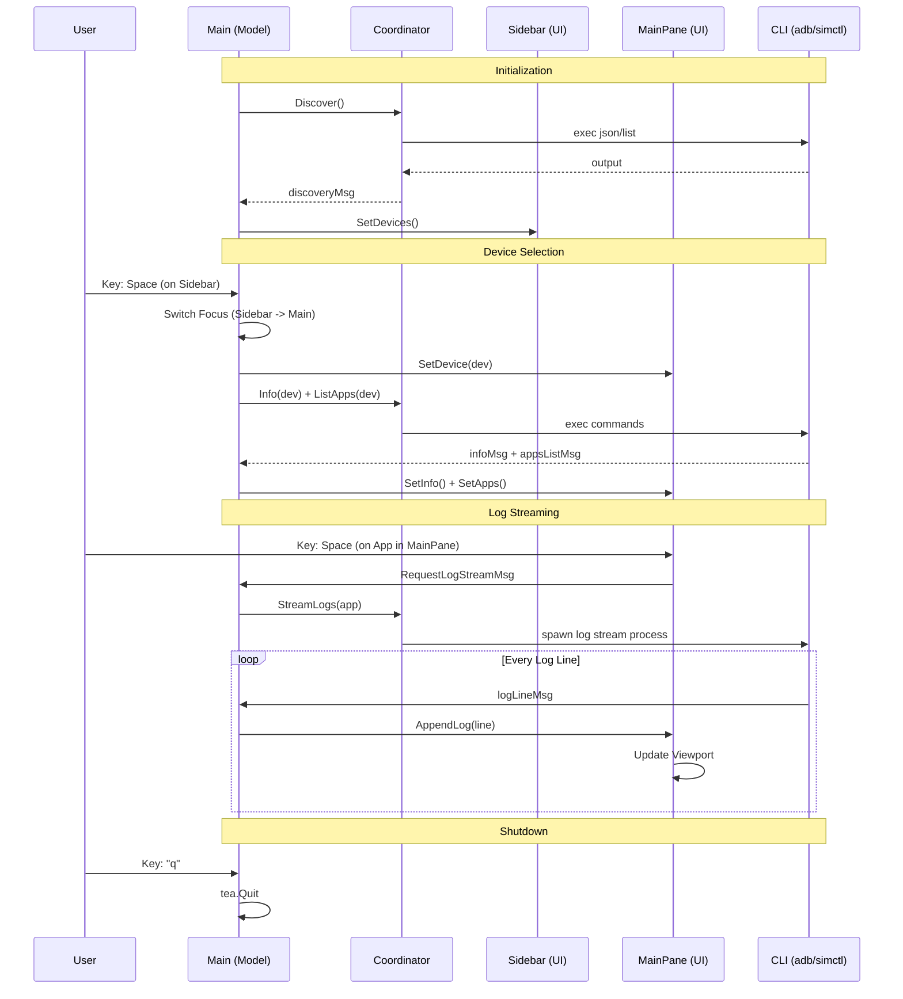

## `pkg/device/` manage logic for iOS/Android interaction.

This package is the **domain layer** — no UI code here, only the logic for 
talking to `iOS/Android` tools. 

> Abstract CLI tools into Go structs.

It has a clear architecture worth understanding first.

---

## Architecture overview

```
device.go          — core types + Coordinator (the hub)
apps.go            — App type + AppLister interface
logs.go            — LogStream type + LogStreamer interface
info.go            — DeviceInfo type + InfoLister interface
files.go           — FileNode type + FileSystem interface + MockFileSystem
ios.go             — iosManager: implements all iOS interfaces
android.go         — androidManager: implements all Android interfaces
ios_files.go       — IOSFileSystem / IOSAppFileSystem
android_files.go   — AndroidFileSystem + ls -laR parser
```

**Pattern:** define an interface in a small file, implement it in the platform file.
The `Coordinator` in `device.go` routes calls to whichever manager handles that
platform.

New capabilities (create/delete/list device types/list runtimes) follow the same
pattern: interface defined in `device.go`, implemented in `ios.go` and `android.go`,
routed via type assertion in the Coordinator.


## Core Models (`device.go`, `info.go`)

- **`Device` struct:** Standard info (ID, Name, Platform, Version, Status).
- **`Platform` enum:** `IOS` or `Android`.
- **`Status` enum:** `Booted`, `Shutdown`, `Unknown`.
- **`DeviceInfo`:** Key/Value pairs for detailed hardware/OS specs.

## Functionality Breakdown

### 1. Device Listing (`ios.go`, `android.go`)
- **iOS:** Run `xcrun simctl list --json`. Parse JSON output.
- **Android:** Run `adb devices -l` (serial) + `emulator -list-avds` (defined images).
- **Purpose:** Provide UI with flat list of available simulators/emulators.

### 2. App Management (`apps.go`)
- **Action:** List installed third-party apps.
- **iOS:** Parse sandbox paths.
- **Android:** Use `adb shell pm list packages`.

### 3. File System (`files.go`, `ios_files.go`, `android_files.go`)
- **Model:** `FileNode` (Name, Path, IsDir, Size, Children).
- **iOS:** Direct disk access to simulator sandbox.
- **Android:** Bridge to `adb shell ls -la`.
- **Purpose:** Browse app data folders in TUI.

### 4. Logs (`logs.go`)
- **Action:** Stream live logs.
- **iOS:** Pipe `xcrun simctl spawn [id] log stream`.
- **Android:** Pipe `adb -s [id] logcat`.

## Why This Way?

- **Abstraction:** UI only see `Device` objects. Logic to handle `adb` quirks vs `simctl` JSON is hidden in package.
- **Concurrency:** Multiple CLI calls run in background so TUI stay responsive.
- **JSON Parsing:** Prefer JSON output from tools when available for stability.

## Step-by-Step Logic

1. **Detection:** Check if `adb` and `xcrun` exist in path.
2. **Polling:** Run CLI commands.
3. **Parsing:** Map text/JSON to Go structs.
4. **Delivery:** Return slices to UI `Update` loop.

## 1. `device.go` — core types and the Coordinator

### Types (lines 10–36)

```go
type Platform string   // "iOS" | "Android"
type Status  string    // "Running" | "Shutdown"

type Device struct {
    ID, Name string
    Platform Platform
    Version  string
    Status   Status
}
```

`Platform` and `Status` are **typed strings** — same reason as `StatusKind` in the UI:
the type system documents valid values and prevents passing arbitrary strings.

### The interface family

```go
type Manager interface {
    ListDevices(ctx context.Context) ([]Device, error)
}

// Optional extensions:
type ToolVersioner    interface { ToolVersion(ctx context.Context) (Platform, string) }
type Booter           interface { Platform() Platform; Boot(ctx, id string) error }
type Shutdowner       interface { Platform() Platform; Shutdown(ctx, id string) error }
type Creator          interface { Platform() Platform; Create(ctx context.Context, name, deviceTypeID, runtimeID string) (string, error) }
type Deleter          interface { Platform() Platform; Delete(ctx context.Context, id string) error }
type DeviceTypeLister interface { Platform() Platform; ListDeviceTypes(ctx context.Context) ([]DeviceType, error) }
type RuntimeLister    interface { Platform() Platform; ListRuntimes(ctx context.Context) ([]Runtime, error) }
```

`Manager` is the base contract. All others are **optional** — a manager
implements them if it can, skips them if not.
This is the **interface segregation principle**:
callers only depend on what they actually need.

`Creator` / `Deleter` handle device lifecycle (create and delete simulators/emulators).
`DeviceTypeLister` / `RuntimeLister` supply the data needed to populate create-device forms.

### New domain types

```go
type DeviceType struct {
    Name       string   // display name, e.g. "iPhone 16 Pro"
    Identifier string   // opaque ID passed to Create, e.g. "com.apple.CoreSimulator.SimDeviceType.iPhone-16-Pro"
}

type Runtime struct {
    Name        string   // display name, e.g. "iOS 18.4"
    Identifier  string   // opaque ID passed to Create
    Version     string   // semver string
    IsAvailable bool     // false = runtime installed but broken/incomplete
}
```

`DeviceType` and `Runtime` are the two required inputs for creating a new iOS simulator.
For Android, `Runtime.Identifier` carries the full system-image package ID
(`system-images;android-34;google_apis;x86_64`) and `DeviceType.Identifier`
carries the AVD hardware profile ID.

### The Coordinator (lines 74–155)

```go
type Coordinator struct { Managers []Manager }
```

Holds a slice of managers (one per platform). It routes calls by **type-asserting** each manager at runtime:

```go
func (c *Coordinator) Boot(ctx context.Context, dev Device) error {
    for _, m := range c.Managers {
        b, ok := m.(Booter)   // does this manager implement Booter?
        if !ok { continue }
        if b.Platform() != dev.Platform { continue }
        return b.Boot(ctx, dev.ID)
    }
    return fmt.Errorf("no booter registered for platform %s", dev.Platform)
}
```

Same pattern for `Shutdown`, `ListApps`, `StreamLogs`, `Info`, `Create`, `Delete`,
`ListDeviceTypes`, `ListRuntimes`. **Why?** Adding a new platform means writing
a new manager and registering it — zero changes to the coordinator.

### `Discover` — concurrent fetching (lines 120–155)

```go
ch := make(chan managerResult, len(c.Managers))

for _, mgr := range c.Managers {
    go func(m Manager) {
        r.devices, r.err = m.ListDevices(ctx)
        ch <- r
    }(mgr)
}

for range len(c.Managers) {
    r := <-ch
    res.Devices = append(res.Devices, r.devices...)
}
```

Launches one goroutine per manager — iOS and Android fetch in parallel.
Buffered channel (`cap = len(Managers)`) prevents goroutines from blocking on send. The collection loop runs exactly `len(Managers)` times, so it exits when all goroutines finish. **No `WaitGroup` needed** because the channel count is known upfront.

---

## 2. `apps.go`, `logs.go`, `info.go` — capability interfaces

Each file follows the same 3-part structure:

```
1. Domain type (App / LogStream / DeviceInfo / InfoField)
2. Interface the manager optionally implements
3. Coordinator routing method
```

### `apps.go`

```go
type App struct {
    BundleID, DisplayName, Name string
    Version, ShortVersion, Type, Path string
}

func (a App) Label() string {
    // CFBundleDisplayName → CFBundleName → BundleID fallback chain
}
```

`Label()` is a **convenience method** — callers don't need to replicate the fallback logic.

### `logs.go`

```go
type LogStream struct {
    Lines <-chan string   // receive-only: consumer reads from here
    Done  <-chan error    // exactly one error after Lines closes
    Stop  func()         // cancels the underlying process
}
```

`<-chan string` (receive-only channel) enforces the contract:
only the producer writes to `Lines`, consumers only read. `Stop` is a 
plain `func()` — safe to call multiple times (it's `context.CancelFunc` 
under the hood).

### `info.go`

```go
type DeviceInfo struct { Fields []InfoField }

func formatBytes(b int64) string   // shared utility used by ios.go and android.go
```

Field order is meaningful — the UI renders them in insertion order,
so the platform managers control the display sequence by the order they
call `add(k, v)`.

---

## 3. `files.go` — the tree type and mock

### `FileNode` (lines 9–17)

```go
type FileNode struct {
    Name, Path  string
    IsDir       bool
    Size        int64
    Modified    time.Time
    Permissions string
    Children    []FileNode   // recursive — nil for files
}
```

A recursive value type. `Children []FileNode` (not pointers) means the whole tree
is one contiguous value — easy to copy, no pointer chasing, no GC pressure for 
large trees.

### `MockFileSystem` (lines 30–80)

Returns hardcoded fixture data. Used during UI development before real device 
access was wired up. Builder helper funcs `file(...)` and `dir(...)` make the 
fixture readable:

```go
dir("Documents",
    file("cache.sqlite", 1_200_000),
    file("sync.log", 482_000),
)
```

---

## 4. `ios.go` — the iOS manager

### `ListDevices` → `parseSimctlOutput`

```
xcrun simctl list devices available --json
  → JSON: {"devices": {"com.apple.CoreSimulator.SimRuntime.iOS-18-5": [...]}}
  → parseSimctlOutput: iterate runtimes, extract version, map State→Status
```

`parseRuntimeVersion("com.apple.CoreSimulator.SimRuntime.iOS-18-5")` → `"18.5"`:

1. Take everything after last `.` → `"iOS-18-5"`
2. Cut at first `-` → `"18-5"`
3. Replace remaining `-` with `.` → `"18.5"`

### `ListApps` — two-command pipeline

```
xcrun simctl listapps <UDID>    → binary plist output
plutil -convert json -o - -     → JSON (no extra dependency needed)
json.Unmarshal → map[string]any → []App
```

`plutil` reads from stdin (`-`) and writes to stdout (`-o -`). The `bytes.NewReader(listOut)` wires the first command's output into the second's stdin.

### `StreamLogs` — goroutine fan-in

```go
var wg sync.WaitGroup
wg.Add(2)
go scan(stdout, &wg)    // goroutine 1: reads stdout lines
go scan(stderr, &wg)    // goroutine 2: reads stderr lines

go func() {
    wg.Wait()           // wait for both scanners to finish
    close(lines)        // signal consumers: stream ended
    done <- cmd.Wait()  // deliver exit error
}()
```

Both stdout and stderr feed into the **same** `lines` channel.
Consumer sees all output regardless of which pipe it came from.
Context cancellation (`<-ctx.Done()`) in each scanner allows `Stop()` to unblock them immediately.

### `Info` — best-effort data gathering

```go
add := func(k, v string) {
    if v == "" { v = "—" }
    info.Fields = append(info.Fields, InfoField{Key: k, Value: v})
}
```

The `add` helper normalizes empty values to `"—"` so the UI never shows blank fields. 
Data comes from two sources:
- **Static:** `device.plist` via `plutil` (always available)
- **Live:** `xcrun simctl spawn <UDID> sw_vers` (only when booted)

---

## 5. `android.go` — the Android manager

### `ListDevices` — two-step merge

```
emulator -list-avds → known AVD names (may be offline)
adb devices         → running serials
adb -s <serial> emu avd name → map serial → AVD name
```

Merge: for each AVD name, check if it appears in the running map.
Sets `Status` accordingly.

### `findAndroidSerial` — AVD name → adb serial

Android uses serials like `emulator-5554` internally but the user knows their AVD by name. 
This function bridges that gap: iterates `adb devices`,
runs `emu avd name` per serial, returns the matching one.

### `androidFetchVersions` — generic function

```go
func androidFetchVersions[E any](ctx context.Context, serial string, byID map[string]E) map[string]string
```

`[E any]` is a **Go generics type parameter** — it accepts any map value type.
This lets the same function work whether `byID` maps to `entry` structs or 
anything else. 
One `dumpsys package packages` call fetches all versions at once instead 
of one `getprop` per app.

### `adbProps` — batched property fetch

```go
cmds := []string{"getprop ro.build.version.release", "getprop ro.build.version.sdk", ...}
adb -s <serial> shell getprop k1; getprop k2; ...
```

One `adb shell` invocation instead of N — each adb call has connection 
overhead (~50ms). Batching all props into one semicolon-joined shell 
command is a significant speedup.

### Create / Delete / ListDeviceTypes / ListRuntimes

```
xcrun simctl list devicetypes --json  →  []DeviceType (Name, Identifier)
xcrun simctl list runtimes --json     →  []Runtime (Name, Identifier, Version, IsAvailable)
xcrun simctl create <name> <dtID> <rtID>  →  UDID string
xcrun simctl delete <UDID>
```

`ListRuntimes` filters out runtimes where `IsAvailable == false` — these are
entries in the JSON that are corrupted or have missing files.
The UI only shows available runtimes in the create-simulator form.

---

## 5b. `android.go` — create / delete / list

### `ListDeviceTypes` — hardware profiles

```
avdmanager list device   →  verbose text output
```

Parsed by `parseAVDManagerDevices`: iterates lines looking for:
- `id: N or "identifier"` → captures the string ID
- `Name: label` → captures the display name
- `---` separator → commits the current record

Returns `[]DeviceType{Name, Identifier}` pairs for the create-emulator form.
Device profile is **optional** in `avdmanager create avd` — passing one 
selects a hardware preset (screen size, RAM etc.).

### `ListRuntimes` — system images

Scans `$ANDROID_SDK/system-images/android-<api>/<tag>/<abi>/` on disk.
Builds package IDs like `system-images;android-34;google_apis;x86_64` — the
exact format `avdmanager create avd --package` expects.

SDK root lookup order:
1. `$ANDROID_HOME` env var
2. `$ANDROID_SDK_ROOT` env var  
3. `~/Library/Android/sdk` (Android Studio default on macOS)

### `Create` — `avdmanager create avd`

```
avdmanager create avd --name <name> --package <sysPkg> [--device <profile>] --force
```

Pipes `"no\n"` to stdin — `avdmanager` always prompts
"Do you wish to create a custom hardware profile?"; the `no` answer skips it
so the process doesn't block waiting for interactive input.
`--force` overwrites an existing AVD with the same name.

### `Delete` — `avdmanager delete avd`

```
avdmanager delete avd --name <name>
```

Android uses AVD names as the delete key (not UDIDs as iOS does).

---

## 6. `ios_files.go` — host-side walk

iOS simulator data lives **on the Mac** at:
`~/Library/Developer/CoreSimulator/Devices/<UDID>/data/Containers`.
No `adb` needed — standard `os.ReadDir`.

### `walkNode` — recursive filesystem walk

```go
func walkNode(ctx, path, info, depth, maxDepth) (FileNode, error) {
    // 1. Check ctx cancellation
    // 2. Build this node from os.FileInfo
    // 3. If file or at maxDepth: return (no recursion)
    // 4. ReadDir; recurse for each child
    // 5. Sort: dirs first, then alphabetical
}
```

Permission errors on a directory are **swallowed** — the dir is returned with no 
children instead of failing the entire walk.
Context cancellation is **propagated** (returned as error), not swallowed.

### `IOSAppFileSystem`

Uses `xcrun simctl get_app_container <UDID> <bundleID> data` to find the app's
specific data container path, then calls the same `walkNode`.

---

## 7. `android_files.go` — remote `ls -laR` parser

Android app sandboxes are on the device, not the Mac. Access goes through:

```
adb -s <serial> shell run-as <packageID> ls -laR
```

`run-as` elevates to the app's UID to read its private `/data/data/<package>/` 
directory.

### `parseLsLaR` — two-pass parse

**Pass 1:** iterate lines, classify each as:
- Directory header (`./cache:`) → update `curDir`
- File entry → parse with `parseLsLine` → append to `entries`

**Pass 2 (`buildLsTree`):**
1. Build `map[relPath]*FileNode` (flat, no children yet)
2. Build `map[parent][]childRelPath` index
3. Recursively `assemble(relPath)` — children built before being copied to parent

**Why two passes?** `ls -laR` output is depth-first but the tree structure needs
children attached to parents.
You can't build the tree in one pass because a parent node might appear before 
you've seen all its children.

---

## Summary — the full dependency graph

```
main.go / model.go
    │
    └── device.Coordinator
            │
            ├── iosManager
            │     ListDevices      → xcrun simctl list
            │     Boot/Shutdown    → xcrun simctl boot/shutdown
            │     Create           → xcrun simctl create
            │     Delete           → xcrun simctl delete
            │     ListDeviceTypes  → xcrun simctl list devicetypes --json
            │     ListRuntimes     → xcrun simctl list runtimes --json
            │     ListApps         → xcrun simctl listapps | plutil
            │     StreamLogs       → xcrun simctl spawn log stream
            │     Info             → device.plist + xcrun simctl spawn sw_vers
            │
            ├── androidManager
            │     ListDevices      → emulator -list-avds + adb devices
            │     Boot             → emulator -avd (detached)
            │     Shutdown         → adb emu kill
            │     Create           → avdmanager create avd (stdin: "no\n")
            │     Delete           → avdmanager delete avd
            │     ListDeviceTypes  → avdmanager list device (parsed)
            │     ListRuntimes     → SDK system-images dir scan
            │     ListApps         → adb pm list packages + dumpsys
            │     StreamLogs       → adb logcat
            │     Info             → config.ini + adb getprop
            │
            ├── IOSAppFileSystem   → xcrun get_app_container + os.ReadDir
            └── AndroidFileSystem  → adb run-as ls -laR + parser
```

- **Interface routing** via type assertions in the Coordinator — extensible without 
  modifying existing code
- **Concurrent discovery** with a buffered channel instead of WaitGroup
- **Optional capabilities** as separate small interfaces (`Booter`, `AppLister`, `Creator`, `Deleter`, `DeviceTypeLister`, `RuntimeLister`, etc.)
- **Receive-only channels** (`<-chan`) to enforce producer/consumer roles
- **Best-effort error handling** — partial data beats total failure for UI-facing code
- **Generics** (`androidFetchVersions[E any]`) for reuse without repeating logic

### App Lifecycle Sequence


