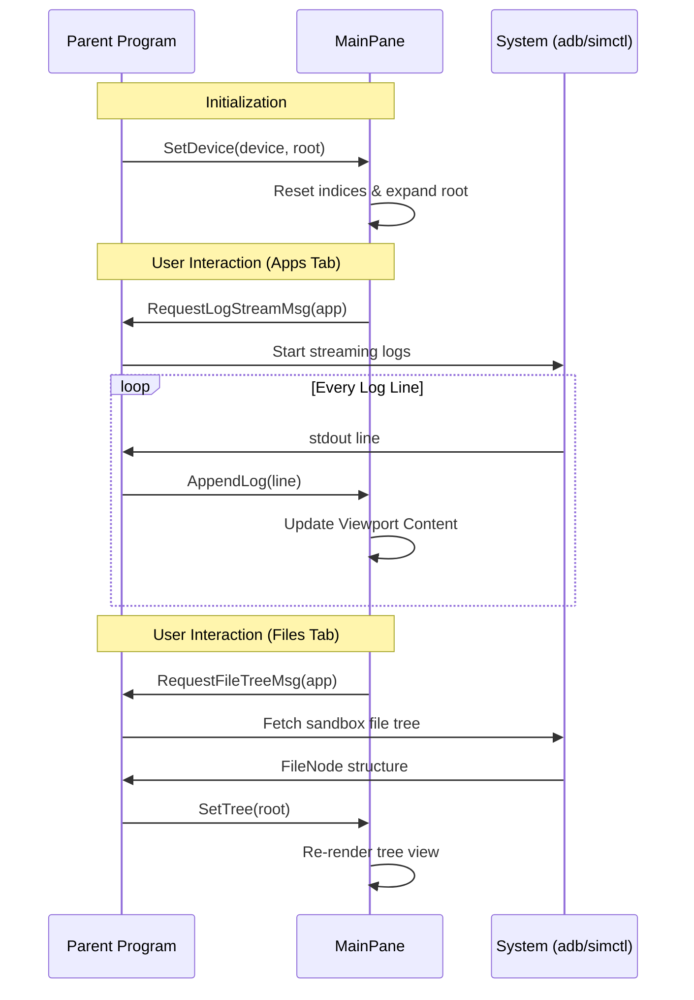

## Structure (`MainPane` struct)

Bubble Tea follows the **Elm Architecture**:

```
User presses key
      ↓
   Update()   ← decides what changes, returns new model + optional command
      ↓
    View()    ← reads the model, returns a string to draw on screen
```

`MainPane` is a **component** — a self-contained piece of that pattern. It has its own `Update` and `View`, and the parent model (the full app) delegates to them.

Holds state for active device, tabs, file tree, apps list, info fields, and logs.
- `logsVP`: `viewport.Model` handles scrollable log text.
- `focused`: boolean for border styling.

## Flow

### 1. Init & Setup
- `NewMainPane()`: Create instance + init viewport.
- `SetSize()`: Calc layout. Deduct lines for borders, tabs, headers. Set viewport dimensions.
- `SetDevice()`: Load device. Reset indices. Expand root folder by default.

### 2. Update (Logic)
- Catch `tea.KeyPressMsg`.
- **Global keys (1-4):** Switch tabs. Tab switch can trigger `tea.Cmd` (e.g., `RequestFileTreeMsg`) to fetch data from parent.
- **Tab-specific logic:**
    - `TabFiles`: Arrow/JK move cursor. Enter toggles `expanded` map (expand/collapse dirs).
    - `TabApps`: Select app. Space starts log streaming (`RequestLogStreamMsg`).
    - `TabInfo`: Space copies value to clipboard.
    - `TabLogs`: Forward msgs to `logsVP.Update`.

### 3. View (Render)
- **Frame:** Manually draw box with `│`, `╭`, `╯`.
- **Header:** Render device name, status dot (green if running), OS version, and UDID.
- **Tabs:** Render clickable headers.
- **Content:** Call sub-renderers based on active tab:
    - `renderInfo`: Key/Value table.
    - `renderApps`: List with version + streaming icon `⊙`.
    - `renderLogs`: Viewport with "streaming" header.
    - `renderFiles`: Two-column split. Left = Tree (indented, caret markers). Right = Preview (metadata + content hint).

## Why This Way?

- **Pure UI:** `MainPane` doesn't fetch data. It emits `Msg` (Requests). Parent program handles I/O (adb/xcrun) → pushes data back via `SetApps`, `AppendLog`.
- **Manual Frame:** Standard Lipgloss borders don't "tee" into inner dividers. Manual drawing allows `┬` / `┴` junctions for clean look.
- **Flattened Tree:** Files stored as recursive nodes but rendered as flat `[]treeRow` list for easy cursor indexing.

---

### 1. The Model (`MainPane` struct, lines 39–57)

```go
type MainPane struct {
    active      *device.Device   // which device is selected (nil = none)
    tab         MainTab          // which tab is active: Info/Apps/Logs/Files
    tree        *device.FileNode // filesystem tree for Files tab
    expanded    map[string]bool  // which dirs are open in the tree
    treeIdx     int              // cursor row in the tree
    apps        []device.App     // list of installed apps
    appsIdx     int              // cursor row in apps list
    selectedApp *device.App      // the app with log streaming ON
    info        device.DeviceInfo
    infoIdx     int
    logs        []string         // buffered log lines
    logBundle   string           // which app's logs we're streaming
    logsVP      viewport.Model   // scrollable viewport for logs
    focused     bool             // does this pane have keyboard focus?
    width, height int
}
```

**Why a struct?** Bubble Tea models must be **value types** that Update returns by copy — so the parent can see "what changed". Pointer fields inside (like `*device.Device`) are fine; the struct itself is passed by value.

---

### 4. Tabs (lines 18–34)

```go
type MainTab int

const (
    TabInfo  MainTab = iota  // 0
    TabApps                  // 1
    TabLogs                  // 2
    TabFiles                 // 3
)
```

`iota` auto-increments integers. The comment says the values **must match the order** of `mainTabs` slice — because `RenderTabs` uses the integer as an index to highlight the active tab.

---

### 5. Constructor (lines 60–65)

```go
func NewMainPane() MainPane {
    vp := viewport.New()
    vp.SoftWrap = true
    vp.Style = lipgloss.NewStyle()...
    return MainPane{expanded: map[string]bool{}, logsVP: vp}
}
```

- Creates a `viewport.Model` (a Bubbles component — a scrollable text area).
- Initializes `expanded` as an empty map (never nil, so no nil-map panics later).

---

### 6. Setters (lines 69–180)

These are called by the **parent model** when async data arrives.
The pane itself never fetches data — it only displays what's handed to it.
That's **separation of concerns**.

| Setter         | What it does                                                  |
| -------------- | ------------------------------------------------------------- |
| `SetSize`      | Recalculates inner dimensions and resizes the log viewport    |
| `SetDevice`    | Loads a device; resets all state (tree, apps, logs, cursor)   |
| `SetTree`      | Replaces only the file tree (loaded async after device loads) |
| `SetApps`      | Loads the app list; clamps cursor if list shrinks             |
| `SetInfo`      | Loads device info fields                                      |
| `SetLogBundle` | Marks which app is streaming; clears old log buffer           |
| `AppendLog`    | Appends a line to the rolling 1000-line buffer                |

**Why rolling buffer?** Lines 172–175:
```go
if len(m.logs) > max {
    m.logs = m.logs[len(m.logs)-max:]
}
```
Prevents unbounded memory growth during long log sessions.

**Auto-scroll trick** (lines 169–179): saves `atBottom` *before* appending,
then re-scrolls only if the user was already at the bottom.
If they scrolled up to read, their position is preserved.

---

### 7. Messages (lines 186–207)

```go
type RequestLogStreamMsg struct { App device.App }
type StopLogStreamMsg struct{}
type RequestFileTreeMsg struct { App device.App }
type AppFocusedMsg struct { App device.App }
```

In Bubble Tea, **messages are how components talk to the rest of the app**.
`MainPane` doesn't call any functions directly — it returns a `tea.Cmd` 
that emits one of these messages. The parent's `Update` receives it and acts.

Think of it like events in browser JS: the component fires an event,
the parent listens.

---

### 8. Update (lines 215–347)

```go
func (m MainPane) Update(msg tea.Msg) (MainPane, tea.Cmd)
```

**Receives a value, returns a new value + a command.** Never mutates in place.

#### Key dispatch flow

```
msg arrives
  ↓
Is it a tea.KeyPressMsg?  (line 216)
  No → return unchanged (MainPane handles only keys)
  Yes ↓
Is it a tab-switch key (1/2/3/4)?  (lines 220–241)
  Yes → change m.tab, maybe emit a message
  No ↓
Dispatch to active tab's handler  (lines 242–345)
```

#### Tab-specific key handling

**Files tab** (lines 243–276): up/down/j/k move `treeIdx`.
`enter` toggles `expanded[path]`, then re-flattens the tree and clamps the cursor.

**Apps tab** (lines 277–317): up/down move `appsIdx`. `space` toggles log 
streaming — if the tapped app is already selected, emit `StopLogStreamMsg`;
otherwise emit `RequestLogStreamMsg`.

**Logs tab** (lines 318–321): delegates key events directly to the 
`viewport.Model` (so PgUp/PgDn/arrows scroll the log).

**Info tab** (lines 322–345): up/down move `infoIdx`. `space` copies 
the selected field's value to clipboard via `CopyToClipboardCmd`.

---

### 9. View (lines 351–406)

```go
func (m MainPane) View() string
```

Builds the panel **as a string** every frame. 
Bubble Tea calls this on every render cycle.

#### Manual frame construction

Instead of using Lip Gloss's border helper, the code **draws the box manually**:

```
╭──────────────────────────────╮
│  title row                   │
│──────────────────────────────│
│  [1 Info] [2 Apps] ...       │
│──────────────────┬───────────│  ← junction at tree/preview split
│  content area    │ preview   │
╰──────────────────┴───────────╯  ← ┴ joins with the separator
```

**Why manual?** The `┬`/`┴` junction glyphs in the Files tab must align with 
the vertical `│` separator inside the content.

Lip Gloss auto-borders can't do that — you'd have to know where inner 
content splits are.

Key lines:

- `hrule` (lines 410–415): draws a `─` rule, optionally inserting a junction
glyph at column `at`.

- `filesLayout` (lines 418–427): computes tree/separator/preview column widths. Tree gets ~52% of width, preview gets the rest, with minimum sizes.

---

### 10. Rendering helpers (lines 431–1075)

Each tab has its own `render*` function:

#### `renderInfo` (lines 491–528)
Windowed list: shows only `visibleH` rows around the cursor.
Keeps cursor on screen by computing `offset`.

#### `renderLogs` (lines 582–626)
Shows a header + the viewport. The viewport handles its own scrolling state.

#### `renderApps` (lines 630–706)
Same windowed pattern as Info.
Each row shows app name + optional streaming icon `⊙` + version.

#### `renderFiles` (lines 720–749)
Splits into two panes side-by-side:
- `renderTreePane` (left) — the expandable directory tree
- `renderPreviewPane` (right) — metadata + content preview for selected node

#### `flattenTree` (lines 758–777)
Converts the recursive `FileNode` tree into a flat `[]treeRow` slice for rendering.
Only includes children of **expanded** directories. `depth` drives the indent width.

```
Documents/          depth 0   →  "▾ Documents      —"
  cache/            depth 1   →  "  ▸ cache         —"
  settings.json     depth 1   →  "    settings.json  4 KB"
```

#### `renderPreviewPane` (lines 921–975)
Shows metadata fields (`previewFields`) and a content hint (`previewContent`).
The content preview is currently static/fake (hardcoded SQLite table names etc.) - placeholder for future real file reading.

---

## 10. Small utilities (lines 1040–1075)

| Function        | Purpose                                                                                  |
| --------------- | ---------------------------------------------------------------------------------------- |
| `padBg(n)`      | Returns `n` spaces with background color — fills empty rows so the background is uniform |
| `formatSize`    | Converts bytes to human-readable (`4 KB`, `1.2 MB`)                                      |
| `padRight`      | Pads a string to fixed width (for key column alignment)                                  |
| `fileExtSuffix` | Extracts `.ext` from filename                                                            |

---

## Summary — how it all fits together

```
Parent app (model.go)
  │
  ├─ Calls SetDevice / SetApps / SetTree / AppendLog
  │     (pushes data in)
  │
  ├─ Calls Update(msg) each keypress
  │     (gets back new pane + optional Cmd)
  │
  ├─ Listens for RequestLogStreamMsg / StopLogStreamMsg / etc.
  │     (pane fires these; parent starts/stops goroutines)
  │
  └─ Calls View() each frame
        (gets back a rendered string to display)
```

The pane is **pure**: no goroutines, no I/O, no global state.
All data flows in through setters; all effects flow out through messages.
That's the Bubble Tea way.


### Sequence Diagram (Data Lifecycle)


