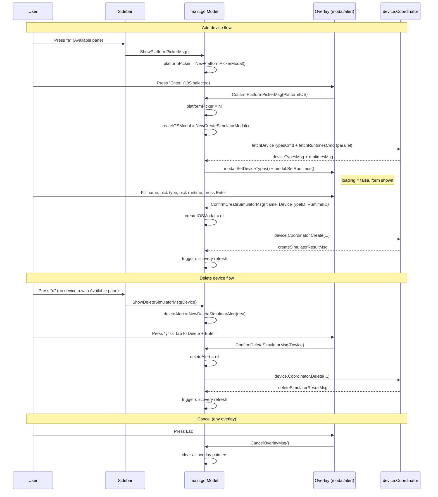

## `ui/overlays.go` — modal overlays for device create/delete

This file contains all overlay UI components and the messages that drive them.
Overlays are rendered **on top of** the normal TUI layout using the
Lip Gloss v2 compositor layer API — they are not part of the Bubble Tea component tree.

---

## Architecture overview

```
Sidebar                  main.go (Model)              overlays.go
  │  'a' pressed    ──▶  ShowPlatformPickerMsg
  │  'd' pressed    ──▶  ShowDeleteSimulatorMsg
  │
  │                      PlatformPickerModal.Update()
  │                        ── ConfirmPlatformPickerMsg ──▶ open iOS or Android modal
  │
  │                      CreateSimulatorModal.Update()
  │                        ── ConfirmCreateSimulatorMsg ──▶ xcrun simctl create
  │
  │                      CreateAndroidEmulatorModal.Update()
  │                        ── ConfirmCreateAndroidEmulatorMsg ──▶ avdmanager create avd
  │
  │                      DeleteSimulatorAlert.Update()
  │                        ── ConfirmDeleteSimulatorMsg ──▶ xcrun simctl delete / avdmanager delete avd
  │
  │                      Any overlay ── CancelOverlayMsg ──▶ clear overlay pointer
```

**Key design:** overlays are self-contained components. They emit messages;
they never call platform tools directly. The parent model (`main.go`) holds a
nullable pointer to the active overlay and routes key events to it first.

---

## 1. Messages (lines 14–43)

```go
type ShowPlatformPickerMsg     struct{}
type ConfirmPlatformPickerMsg  struct{ Platform device.Platform }
type ShowDeleteSimulatorMsg    struct{ Device device.Device }
type ConfirmCreateSimulatorMsg struct {
    Name         string
    DeviceTypeID string
    RuntimeID    string
}
type ConfirmCreateAndroidEmulatorMsg struct {
    Name            string
    SystemImagePkg  string
    DeviceProfileID string   // may be empty
}
type ConfirmDeleteSimulatorMsg struct{ Device device.Device }
type CancelOverlayMsg          struct{}
```

Messages follow the **Bubble Tea event bus pattern**: an overlay emits a typed
message as a `tea.Cmd`; the parent's `Update` receives it in the next tick and
acts (opens another overlay, calls the device package, clears the pointer).

`Device device.Device` in `ShowDeleteSimulatorMsg` and `ConfirmDeleteSimulatorMsg`
is a **value copy** — the sidebar captures `d := *dev` before emitting.
Safe even if the underlying slice later changes.

---

## 2. `PlatformPickerModal` — two-item list (lines 431–516)

A simple step-zero overlay: choose iOS or Android before committing to a
longer create flow.

```
╭─────────────────────────────────────────────╮
│                                             │
│  Add Device                                 │
│                                             │
│  Select platform:                           │
│                                             │
│  ▸ iOS Simulator                            │
│    Android Emulator                         │
│                                             │
│  ↑↓ select  Enter confirm  Esc cancel       │
│                                             │
╰─────────────────────────────────────────────╯
```

| Key | Action |
|---|---|
| `↑` / `k` | move cursor up |
| `↓` / `j` | move cursor down |
| `Enter` | emit `ConfirmPlatformPickerMsg{Platform}` |
| `Esc` | emit `CancelOverlayMsg{}` |

State: single `idx int`. iOS is index 0 (default).
`platformPickerItems` is a package-level slice — allocated once, not per frame.

---

## 3. `CreateSimulatorModal` — iOS create form (lines 45–274)

Three-field form: Name (text input) → Device Type (scrollable list) → Runtime (scrollable list).

```
╭──────────────────────────────────────────────────────────────╮
│                                                              │
│  New iOS Simulator                                           │
│                                                              │
│  Name                                                        │
│  e.g. My iPhone 16 Pro█                                      │
│                                                              │
│  Device Type                                            3/42 │
│  ▸ iPhone 16 Pro                                             │
│    iPhone 16 Pro Max                                         │
│    iPhone 16                                                 │
│    iPhone 16 Plus                                            │
│    iPhone SE (3rd generation)                                │
│                                                              │
│  Runtime                                                1/3  │
│  ▸ iOS 18.4                                                  │
│    iOS 17.5                                                  │
│    iOS 16.4                                                  │
│                                                              │
│  Tab next  ↑↓ select  Enter create  Esc cancel               │
│                                                              │
╰──────────────────────────────────────────────────────────────╯
```

### State

```go
type CreateSimulatorModal struct {
    nameInput   textinput.Model
    deviceTypes []device.DeviceType
    runtimes    []device.Runtime
    dtIdx, rtIdx         int   // cursor positions
    dtOffset, rtOffset   int   // scroll offsets (viewport into list)
    focused              createField
    loading              bool
}
```

`loading` is `true` until both `SetDeviceTypes` and `SetRuntimes` have been called.
While loading, the modal renders a single "Loading…" line — no interaction possible.

### Navigation

| Key | Action |
|---|---|
| `Tab` | advance to next field (wraps: Runtime → Name) |
| `Shift+Tab` | previous field |
| `↑` / `k` | scroll list cursor up (Device Type or Runtime field) |
| `↓` / `j` | scroll list cursor down |
| `Enter` (on last field) | submit if `canSubmit()`, else advance field |
| `Esc` | `CancelOverlayMsg{}` |

`canSubmit()` requires: non-empty name, at least one device type, at least one runtime.
`Enter` on the **Runtime** field (last) submits; on earlier fields it just advances focus.

### Scrolling

`listShowRows = 5` — always show exactly 5 rows from each list.
`dtOffset` / `rtOffset` track the first visible index.
When cursor moves past the bottom of the window: `offset = idx - listShowRows + 1`.
When cursor moves past the top: `offset = idx`.

### Loading sequence

```
NewCreateSimulatorModal() called
    │
    ├── modal.loading = true
    ├── nameInput.Focus() → returns cursor-blink Cmd
    │
    │  (parent fires fetchDeviceTypesCmd + fetchRuntimesCmd in parallel)
    │
    ├── SetDeviceTypes(types) called → checks if runtimes ready
    └── SetRuntimes(runtimes) called → checks if deviceTypes ready
            │
            └── when both non-empty: loading = false → form shown
```

`SetRuntimes` filters out runtimes where `IsAvailable == false` before storing.

---

## 4. `CreateAndroidEmulatorModal` — Android create form (lines 518–739)

Mirrors `CreateSimulatorModal` in UX. Fields:
- **Name** — AVD name (no spaces; AVD manager restriction)
- **System Image** — required; maps to `--package` argument
- **Device Profile** — optional; maps to `--device` argument

Uses `fieldDeviceType` slot for System Image and `fieldRuntime` slot for
Device Profile — reuses the same `createField` enum to avoid a new type.

Android accent color (`ColorAndroid` green) replaces the iOS `ColorAccent` blue
in borders, labels, and selected-item highlight.

`canSubmit()` only requires name + system image — device profile can be empty
(avdmanager will use a generic hardware profile).

### `buildConfirmCmd` (lines 654–668)

```go
func (m CreateAndroidEmulatorModal) buildConfirmCmd() tea.Cmd {
    name   := strings.TrimSpace(m.nameInput.Value())
    sysPkg := m.systemImages[m.imgIdx].Identifier
    profID := ""
    if len(m.deviceProfiles) > 0 && m.profIdx < len(m.deviceProfiles) {
        profID = m.deviceProfiles[m.profIdx].Identifier
    }
    return func() tea.Msg {
        return ConfirmCreateAndroidEmulatorMsg{Name: name, SystemImagePkg: sysPkg, DeviceProfileID: profID}
    }
}
```

Captures values into the closure before returning — safe even though the
modal struct is a value receiver and may be copied before the Cmd fires.

---

## 5. `DeleteSimulatorAlert` — confirmation dialog (lines 322–429)

Two-button dialog: Cancel (default focus) / Delete.

```
╭──────────────────────────────────────────────────╮
│                                                  │
│  Delete Simulator                                │
│                                                  │
│  "iPhone 16 Pro"                                 │
│  This cannot be undone.                          │
│                                                  │
│          ╭────────╮   ╭────────╮                 │
│          │ Cancel │   │ Delete │                 │
│          ╰────────╯   ╰────────╯                 │
│                                                  │
│  Tab switch  y delete  Esc cancel                │
│                                                  │
╰──────────────────────────────────────────────────╯
```

Title adapts: "Delete Simulator" for iOS, "Delete Emulator" for Android.

| Key | Action |
|---|---|
| `Tab` / `←→` / `h` / `l` | switch focus between Cancel and Delete |
| `Enter` | confirm focused button (Cancel → `CancelOverlayMsg`, Delete → `ConfirmDeleteSimulatorMsg`) |
| `y` / `Y` | shortcut: confirm delete regardless of focus |
| `n` / `N` / `Esc` | cancel |

### Button alignment fix

Both buttons always have `lipgloss.RoundedBorder()` — even the unfocused
Cancel button. This ensures both are exactly 3 lines tall.

```go
buttons := lipgloss.JoinHorizontal(lipgloss.Top, cancelBtn, "   ", deleteBtn)
b.WriteString(lipgloss.NewStyle().Width(innerW).Align(lipgloss.Center).Background(ColorBg).Render(buttons))
```

**Why `JoinHorizontal(Top)` + `Align(Center)`?**
`strings.Repeat(" ", pad) + multilineStr` only prepends padding to the **first
line** of a multi-line block — the border box bottom line would be left-aligned
while the top was indented. Using `lipgloss.Width(n).Align(Center)` centers
each line of the multi-line block independently.

---

## 6. Shared helpers (lines 276–319)

### `modalListHeader`

```go
func modalListHeader(label string, count, idx, innerW int) string
```

Renders `Label` on the left and `idx+1/count` counter on the right — flex
justify-between within `innerW`. Returns just the label if count is 0.

### `renderDeviceTypeList` / `renderRuntimeList`

Both render a windowed slice of items (5 visible at a time):

```
▸ selected item padded to full width    ← inverse colors when focused
  other item
  other item
```

Use `truncateName` from `sidebar.go` so long names never overflow the modal width.

---

## Why this way?

**Overlay-as-component:** each modal is a plain Go struct with `Update` / `View`.
No global state, no channels. The parent holds a `*Modal` pointer — when `nil`
there is no overlay, when non-nil the parent routes keys there first.

**Layer compositor:** Lip Gloss v2 removed `PlaceOverlay`. The new API:

```go
bg := lipgloss.NewLayer(baseStr)
fg := lipgloss.NewLayer(overlayStr).X(x).Y(y).Z(1)
baseStr = lipgloss.NewCompositor(bg, fg).Render()
```

`X`/`Y` position the overlay absolutely; `Z(1)` ensures it paints over the base.
Centering: `x = max((totalW - modalW) / 2, 0)`, same for Y.

**Two-step create:** Platform picker → platform-specific form.
This avoids a single giant form with platform-conditional fields.
The picker is a cheap 2-item list; the heavier form (with async loading) only
starts after the user commits to a platform.

---

## Overlay lifecycle sequence


