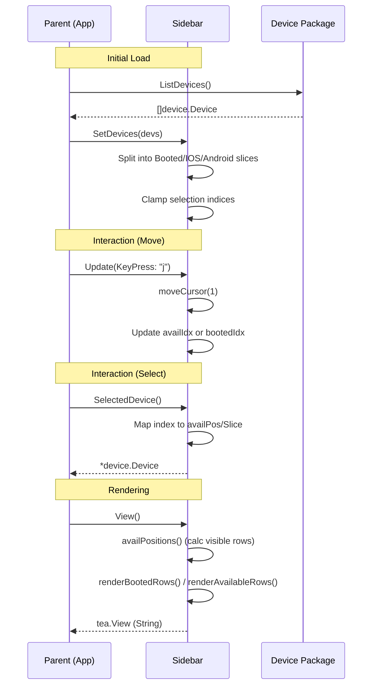
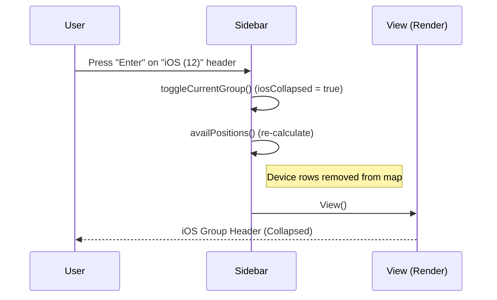

## Structure (`Sidebar` struct)
This file implements the **left navigation panel** — the list of devices the user can select.
Two sub-panels: 

**Booted** (running devices) 
**Available** (stopped, grouped by platform).

- `focused`: track which panel (Booted/Available) has cursor.
- `bootedIdx`, `availIdx`: track cursor position in each panel.
- `iosCollapsed`, `androidCollapsed`: track expansion state of groups in Available panel.

```
╭─ Booted ───────── 2 ─╮
│ ● iPhone 15    17.5  │
│ ● ▲ Pixel 8    14.0  │
╰──────────────────────╯
╭─ Available ────── 6 ─╮
│ ▸  iOS            (3)│
│ ▾ ▲ Android       (3)│
│    ▲ Pixel 7  13.0   │
│    ▲ Nexus 5  10.0   │
╰──────────────────────╯
```

Two boxes, each with a header count and scrollable rows.
iOS/Android groups can collapse.

## 1. Flow

### 1. Setup & Data

- `SetDevices()`: Sort flat list into groups. Running → `booted`. Off → `iosAvail` or `andAvail`.
- `availPositions()`: Calc visible cursor stops. If group collapsed, skip device rows.

### 2. Update (Logic)

- Catch `tea.KeyPressMsg`.
- **Vertical (J/K/Up/Down):** Move cursor within `focused` pane.
- **Switch (Tab/H/L/Arrows):** Swap focus between Booted and Available panels.
- **Action (Enter):** If cursor on group header in Available pane, toggle `collapsed` state.

### 3. View (Render)

- `View()`: Render two `RenderBox` components vertically.
- `renderBootedRows()`: List running devices.
- `renderAvailableRows()`: List headers + devices. Insert empty row separator between platforms.
- `renderDeviceRow()`: Complex layout. Dot for status + Name (left) + Version (right). Truncate name if too wide.

## Why This Way?

- **Dual-Pane Navigation:** Sidebar act as two independent lists. Focus swap allow separate scroll memory (`bootedIdx` vs `availIdx`).
- **Dynamic Positions:** `availPositions()` map screen index to actual device pointer. Handle "Virtual Rows" (headers) that aren't devices.
- **Pure Component:** Sidebar know nothing about `adb` or `simctl`. Only render what it given.


---
## 2. The struct (lines 30–45)

```go
type Sidebar struct {
    booted   []device.Device   // running devices (any platform)
    iosAvail []device.Device   // stopped iOS devices
    andAvail []device.Device   // stopped Android devices

    focused      SidebarPane   // which box has inner focus
    outerFocused bool          // does sidebar have app-level focus?
    bootedIdx    int           // cursor in Booted box
    availIdx     int           // cursor in Available box (see availPos below)

    iosCollapsed     bool
    androidCollapsed bool

    width, height int
}
```

**Key design choice:** `SetDevices` splits the flat `[]device.Device` into 
three buckets on write (lines 70–88). Rendering never re-filters — it reads 
the pre-split slices directly. Faster view, simpler rendering code.

---

## 3. `SetDevices` — splitting on write (lines 70–88)

```go
func (s *Sidebar) SetDevices(devs []device.Device) {
    s.booted = s.booted[:0]      // reuse backing array, zero length
    s.iosAvail = s.iosAvail[:0]
    s.andAvail = s.andAvail[:0]
    for _, d := range devs {
        if d.Status == device.StatusRunning {
            s.booted = append(s.booted, d)
            continue
        }
        switch d.Platform {
        case device.PlatformIOS:     s.iosAvail = append(s.iosAvail, d)
        case device.PlatformAndroid: s.andAvail = append(s.andAvail, d)
        }
    }
    s.bootedIdx = clampIdx(s.bootedIdx, len(s.booted))
    s.availIdx  = clampIdx(s.availIdx,  s.availableLen())
}
```

`s.booted[:0]` resets length to 0 but **keeps the allocated memory** — avoids a 
GC allocation on every refresh. After filling, `clampIdx` ensures the cursor 
doesn't point past the end of the new (possibly shorter) list.

---

## 4. The `availPos` cursor model (lines 189–235)

This is the most interesting design in the file. The Available pane has
**two kinds of rows**: group headers and device rows.

Rather than special-casing them everywhere, the code builds a flat list of
`availPos` values:

```go
type availPos struct {
    isHeader bool
    group    int   // 0 = iOS, 1 = Android
    devIdx   int   // index into iosAvail or andAvail
}
```

`availPositions()` builds this list on demand:

```
If iOS group exists:
  [ {isHeader, group:0} ]           ← header always present
  [ {group:0, devIdx:0}, ... ]      ← devices only if not collapsed

If Android group exists:
  [ {isHeader, group:1} ]
  [ {group:1, devIdx:0}, ... ]
```

**Why?** `availIdx` is just an integer.
It can land on a header or a device without any special logic.
Moving up/down is just `availIdx ± 1` — `availPositions()` abstracts away the structure.

`availDeviceAt(idx)` translates a position back to a `*device.Device` — returns `nil` if it's a header (so the parent knows "nothing to load").

---

## 5. `toggleCurrentGroup` (lines 240–261)

Called when user presses `enter` on a group header:

```go
func (s *Sidebar) toggleCurrentGroup() {
    positions := s.availPositions()
    cur := positions[s.availIdx]
    if !cur.isHeader { return }     // only works on headers

    switch cur.group {
    case 0: s.iosCollapsed = !s.iosCollapsed
    case 1: s.androidCollapsed = !s.androidCollapsed
    }

    // re-anchor cursor onto the same header after list changes shape
    for i, p := range s.availPositions() {
        if p.isHeader && p.group == cur.group {
            s.availIdx = i
            return
        }
    }
}
```

**Why re-anchor?** Toggling collapse changes the total length of `availPositions()`.
The header's index may shift (e.g. collapsing iOS moves the Android header up).
Without re-anchoring, the cursor would point to a different row.

---

## 6. `Update` (lines 117–139)

```go
func (s Sidebar) Update(msg tea.Msg) (Sidebar, tea.Cmd) {
    k, ok := msg.(tea.KeyPressMsg)
    if !ok { return s, nil }

    switch k.String() {
    case "up", "k":       s.moveCursor(-1)
    case "down", "j":     s.moveCursor(1)
    case "tab", "right", "l", "left", "h", "shift+tab":
        // toggle between Booted and Available
        if s.focused == PaneBooted { s.focused = PaneAvailable } else { s.focused = PaneBooted }
    case "enter":
        if s.focused == PaneAvailable { s.toggleCurrentGroup() }
    }
    return s, nil
}
```

Sidebar emits **no commands** — it never needs to trigger async work itself.
The parent reads `SelectedDevice()` after each update to decide what to load.
Clean separation.

`moveCursor` (lines 174–185) routes to the right index based on `s.focused`.

---

## 7. `View` (lines 144–170)

```go
func (s Sidebar) View() string {
    bootedBox := RenderBox("Booted", count, s.renderBootedRows(), ...)

    availHeight := max(s.height - lipgloss.Height(bootedBox) - 1, 3)

    availBox := RenderBox("Available", count, s.renderAvailableRows(), ..., availHeight, ...)

    gap := lipgloss.NewStyle().Background(ColorBg).Width(s.width).Render("")
    return lipgloss.JoinVertical(lipgloss.Left, bootedBox, gap, availBox)
}
```

**Dynamic height split:** Booted box is sized to its content (grows with more running devices). Available box gets whatever vertical space is left (`totalHeight - bootedHeight - 1 gap line`).
Minimum 3 lines so it never disappears.

`lipgloss.JoinVertical` stacks the two boxes with a blank gap line between them.

---

## 8. Rendering rows (lines 263–446)

### `renderBootedRows` / `renderAvailableRows`
Walk their respective slices, call `renderDeviceRow` or `renderGroupHeader` per item,
join with `\n`.

### `renderDeviceRow` (lines 349–401)
Implements **flex justify-between** manually:

```
" ●  iPhone 15 Pro Max     17.5 "
 ^  ^                      ^   ^
 pad dot+glyph  name      ver  pad
```

Width math:
```
gap = innerW - prefixW - nameWidth - verWidth - rightPad
```
If `gap` would go negative, `truncateName` clips the name so it always fits in 
exactly `innerW` cells.

Selected row: renders **entire row as one styled block** (inverse colors).
Non-selected: each segment styled individually.

### `renderGroupHeader` (lines 403–433)
Same width math, adds `▾`/`▸` caret based on `collapsed`.

### `truncateName` (lines 326–343)
Clips by **visible cell width**, not byte count.
Walks runes right-to-left until the prefix fits within `max-1` cells, then appends`…`.
Handles multi-byte and wide (CJK) characters correctly because it uses `lipgloss.Width`, not `len`.

### `clampIdx` (lines 448–459)
Utility: keeps an index in `[0, n-1]`. Returns 0 if list is empty.
Used everywhere a list might shrink.

---

## 9. Summary — data flow

```
Parent calls SetDevices(devs)
        ↓
  Sidebar splits into booted / iosAvail / andAvail
  Clamps cursor indices

Parent calls Update(keyMsg)
        ↓
  Sidebar moves cursor or toggles group
  Returns new Sidebar (value copy), no Cmd

Parent calls SelectedDevice()
        ↓
  Returns *device.Device at cursor, or nil
  Parent decides what to load in MainPane

Parent calls View()
        ↓
  Sidebar builds two boxes, joins vertically
  Returns string
```

The sidebar **owns** selection state but **never fetches data**. 
All communication to the rest of the app goes through `SelectedDevice()` — a pull model, not push. The parent polls it after every `Update`.

### Sidebar Data & Focus Flow



### Navigation Map (Available Pane)


